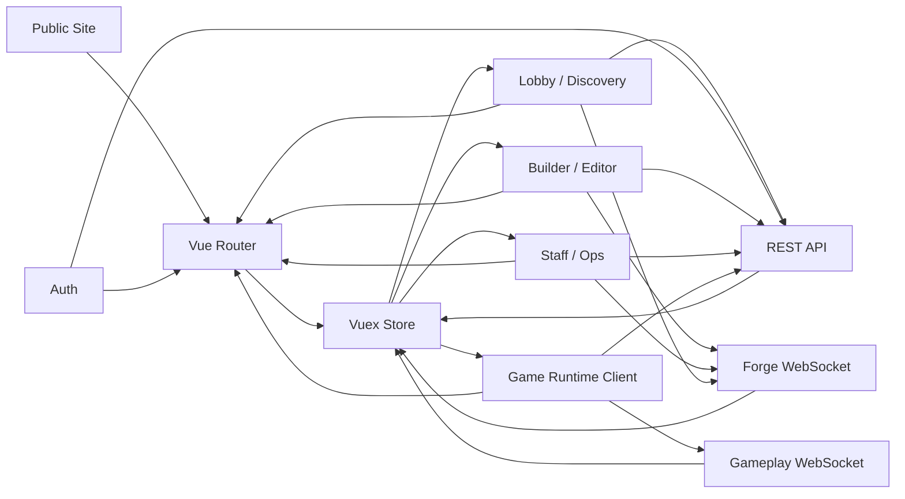

# 13) System Map

## In simple terms

High-level architecture map of major frontend parts and connections.

## Related pages

- [01-system-overview.md](./01-system-overview.md)
- [05-state-and-data-flow.md](./05-state-and-data-flow.md)
- [09-dependency-graph.md](./09-dependency-graph.md)
- [14-entity-relationship-map.md](./14-entity-relationship-map.md)
