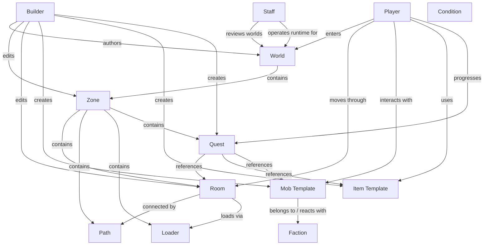

# 14) Entity Relationship Map (Conceptual)

## In simple terms

This is a conceptual relationship graph, not strict database schema.

## Related pages

- [06-builder-architecture.md](./06-builder-architecture.md)
- [07-game-runtime.md](./07-game-runtime.md)
- [08-admin-and-ops.md](./08-admin-and-ops.md)
- [13-system-map.md](./13-system-map.md)
